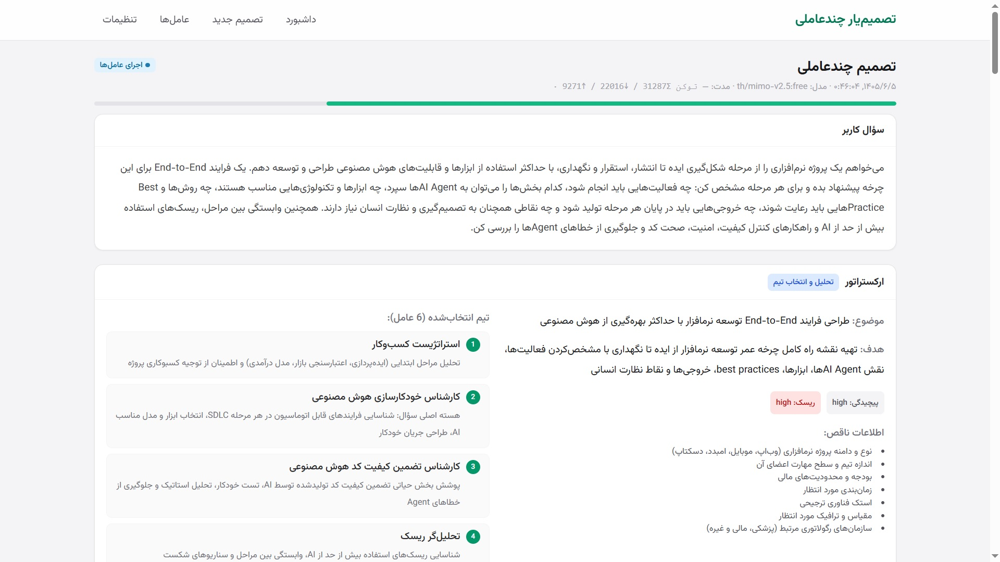
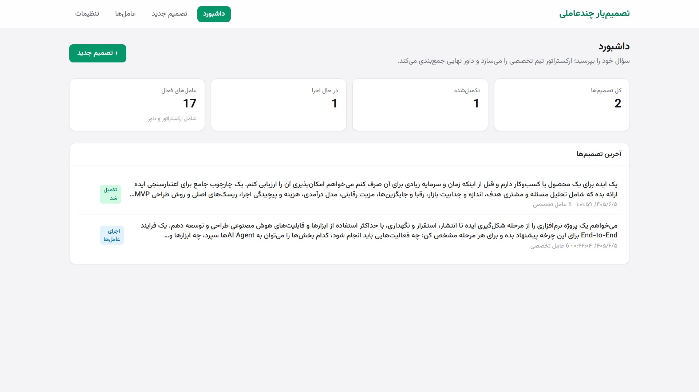

# Ox Alpha — تصمیم‌یار چندعاملی

سیستم تصمیم‌یار چندعاملی: کاربر سؤال می‌پرسد، **ارکستراتور** سؤال را تحلیل و عامل‌های تخصصی مرتبط را به‌صورت پویا انتخاب می‌کند، هر عامل از زاویه تخصص خود بررسی می‌کند و **داور نهایی** در پایان پاسخ نهایی، ریسک‌ها و برنامه اقدام را تولید می‌کند.





---

## ویژگی‌ها

- **ارکستراتور پویا** — تیم تخصصی را بر اساس سؤال کاربر انتخاب می‌کند (حداکثر ۶ عامل)
- **۹ عامل تخصصی پیش‌فرض** — مالی، ریسک، روان‌شناس، مشاور شغلی، استراتژیست، حقوقی، منتقد، برنامه‌ریز اقدام، و داور نهایی
- **انتخاب مدل اختصاصی** — ارکستراتور برای هر عامل بهترین مدل را از کتابخانه مدل‌ها انتخاب می‌کند
- **پشتیبانی از مدل‌های پیشنهادی** — اگر هیچ عامل موجودی مناسب نباشد، عامل جدید با systemPrompt اختصاصی پیشنهاد می‌دهد
- ** resumes از خطا** — در صورت شکست میان‌خط، از مرحله خطا ادامه می‌دهد (بدون شروع مجدد)
- **جمع‌بندی داور** — پاسخ نهایی بی‌طرفانه با ریسک‌ها، نقاط قوت/ضعف و برنامه اقدام گام‌به‌گام
- **رابط فارسی RTL** با Vazirmatn و Tailwind CSS
- **امنیت API Key** — رمزنگاری AES-256-GCM در SQLite، عدم ذخیره متن ساده
- **اتصال به هر سرویس سازگار با OpenAI** — OpenAI، OpenRouter، LM Studio، Ollama، و هر gateway سفارشی

---

## ساختار خط لوله

```
سؤال کاربر
    │
    ▼
┌──────────────┐
│  ارکستراتور   │  ← تحلیل سؤال، انتخاب تیم و مدل‌ها
└──────┬───────┘
       │
       ▼
┌──────────────┐     ┌──────────────┐     ┌──────────────┐
│  عامل ۱      │────▶│  عامل ۲      │────▶│  عامل ۳      │  ← اجرای ترتیبی
└──────────────┘     └──────────────┘     └──────────────┘
       │
       ▼
┌──────────────┐
│  داور نهایی  │  ← جمع‌بندی، ریسک‌ها، برنامه اقدام
└──────────────┘
```

---

## اجرا

### پیش‌نیازها

- Node.js ≥ 18
- npm

### نصب و راه‌اندازی

```bash
git clone https://github.com/silverman2009/multi-agent-decider.git
cd multi-agent-decider.git
npm install
```

### تنظیم متغیر محیطی

```bash
cp .env.example .env
```

تولید کلید رمزنگاری:

```bash
node -e "console.log(require('crypto').randomBytes(32).toString('hex'))"
```

مقدار تولیدشده را در `.env` قرار دهید:

```
ENCRYPTION_KEY=<your-generated-key>
```

> در حالت production اگر `ENCRYPTION_KEY` تنظیم نشده باشد، برنامه با خطای واضح بالا نمی‌آید.

### اجرا

```bash
npm run dev          # http://localhost:4310
```

### آزمایش بدون مدل واقعی

```bash
npm run mock         # سرور سازگار OpenAI روی پورت 4545
```

سپس در صفحه «تنظیمات»:
- **Base URL:** `http://localhost:4545/v1`
- **Key:** اختیاری
- **Model:** `mock-mini`

---

## صفحات

| مسیر | شرح |
|------|------|
| `/` | داشبورد: آمار و آخرین تصمیم‌ها |
| `/decisions/new` | ایجاد تصمیم جدید |
| `/decisions/[id]` | نمایش زنده فرآیند چندعاملی (polling) |
| `/settings` | تنظیمات اتصال مدل + دریافت مدل‌ها |
| `/agents` | مدیریت عامل‌ها و تنظیمات اختصاصی هر عامل |

---

## API داخلی

| Method | Endpoint | شرح |
|--------|----------|------|
| GET/POST | `/api/settings` | فهرست/ایجاد تنظیمات اتصال |
| PATCH/DELETE | `/api/settings/[id]` | ویرایش، پیش‌فرض‌سازی، حذف |
| POST | `/api/models` | دریافت مدل‌ها از سرویس ارائه‌دهنده |
| GET/POST | `/api/agents` | فهرست/ایجاد عامل |
| GET/PATCH/DELETE | `/api/agents/[id]` | جزئیات/ویرایش/حذف عامل |
| GET/POST | `/api/decisions` | فهرست/ایجاد تصمیم و شروع خط لوله |
| GET/POST/DELETE | `/api/decisions/[id]` | جزئیات زنده/اجرا مجدد/حذف |

---

## حل تنظیمات اتصال مدل

هر عامل می‌تواند تنظیمات اختصاصی خود داشته باشد. تقدم حل:

```
فیلد اختصاصی عامل → تنظیمات متصل‌شده → تنظیمات پیش‌فرض فعال → خطای «تنظیمات ناقص»
```

عامل‌های `orchestrator` و `judge` محافظت‌شده‌اند: غیرفعال‌سازی/حذف آن‌ها ممنوع است.

---

## امنیت

- **رمزنگاری کلید API** — ذخیره در SQLite فقط با AES-256-GCM (کلید از `ENCRYPTION_KEY`)
- **عدم ذخیره متن ساده** — کلید در localStorage/state عمومی/URL ذخیره نمی‌شود
- **عدم لاگ** — کلید در لاگ سرور یا پاسخ API نمایش داده نمی‌شود
- **پشتیبانی از سرویس‌های بدون کلید** — Ollama و سرویس‌های محلی بدون نیاز به API key کار می‌کنند

---

## Stack

| لایه | فناوری |
|------|--------|
| فریمورک | Next.js 14 (App Router) |
| زبان | TypeScript |
| UI | React 18 + Tailwind CSS |
| فونت | Vazirmatn (فارسی) |
| پایگاه داده | SQLite (`sqlite3`) |
| رمزنگاری | AES-256-GCM |
| مدل‌ها | هر سرویس سازگار با OpenAI API |

---

## ساختار پروژه

```
├── src/
│   ├── app/                    # صفحات و API routes
│   │   ├── api/                # endpoint‌های سرور
│   │   ├── decisions/          # صفحات تصمیم
│   │   ├── agents/             # مدیریت عامل‌ها
│   │   └── settings/           # تنظیمات اتصال
│   ├── components/             # کامپوننت‌های React
│   └── lib/
│       ├── engine.ts           # موتور خط لوله چندعاملی
│       ├── db.ts               # اتصال SQLite + migration‌ها
│       ├── llm.ts              # تماس با مدل‌ها (OpenAI-compatible)
│       ├── provider.ts         # حل تنظیمات اتصال
│       ├── crypto.ts           # رمزنگاری API key
│       ├── seed-agents.ts      # عامل‌های پیش‌فرض
│       └── types.ts            # تایپ‌های مشترک
├── scripts/
│   └── mock-openai.mjs         # سرور سازگار OpenAI برای آزمایش
├── data/                       # فایل SQLite (gitignored)
├── .env.example
└── package.json
```

---

## مجوز

MIT
